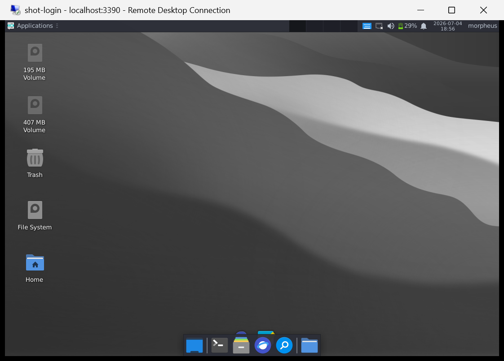
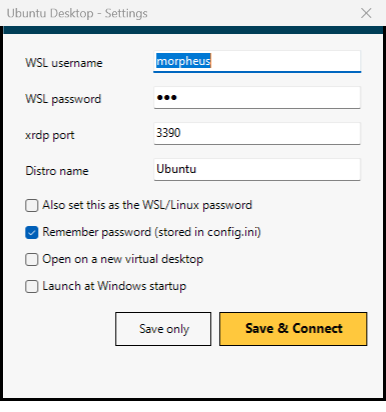

# UbuntuDesktop — One-Click WSL2 Ubuntu Desktop Launcher for Windows

**Open a full Ubuntu Linux desktop (GUI) from Windows with a single double-click.** UbuntuDesktop is a tiny (~25 KB) portable Windows `.exe` that boots WSL2, starts the xrdp remote-desktop server, **auto-logs in**, and opens your Ubuntu XFCE desktop **fullscreen** — no terminal, no login screen, no configuration on every launch.

> Keywords: WSL2 GUI, Ubuntu desktop on Windows, WSL xrdp, WSLg alternative, run Linux GUI on Windows 11, XFCE remote desktop, one-click WSL desktop, WSL2 RDP auto-login.



---

## Why this exists

WSL2 runs Linux GUI apps one window at a time (WSLg), but there is no simple, built-in way to open a **full Linux desktop** — panels, dock, file manager, the works — as one clean fullscreen window. The usual xrdp route means editing configs, typing a username and password into an ugly login box every time, and fighting black screens and wrong resolutions.

UbuntuDesktop turns all of that into **one double-click**.

## Features

- 🖱️ **True one-click** — double-click the exe, the Ubuntu desktop opens fullscreen
- 🔓 **Auto-login** — the native xrdp login screen never appears
- 🖥️ **Real fullscreen** at your monitor's native resolution; resize the window and the desktop scales like an image (**no scrollbars**)
- 🔄 **Self-healing** — starts WSL and xrdp automatically if they are not running, and keeps WSL alive
- 🔐 **Password sync** — optionally set your WSL/Linux password straight from the app, so the Linux and remote passwords never drift apart
- 🆕 **New virtual desktop** option — open Ubuntu on its own Windows virtual desktop
- 🚀 **Launch at Windows startup** option
- 🔑 **No secrets in the binary** — credentials live in a git-ignored `config.ini`
- 📦 **Portable & dependency-free** — a single exe built with the C# compiler that ships inside Windows

## Screenshots

| Settings | Ubuntu desktop |
|---|---|
|  |  |

---

## Requirements

- Windows 10 or 11 with **WSL2** installed
- An **Ubuntu** distribution in WSL (`wsl --install -d Ubuntu`)

## Step 1 — Install the Ubuntu desktop (GUI) inside WSL

Open Ubuntu (`wsl -d Ubuntu`) and run:

```bash
# 1. XFCE desktop + xrdp remote-desktop server
sudo apt update
sudo apt install -y xfce4 xfce4-goodies xrdp

# 2. Move xrdp to port 3390 so it never clashes with Windows' own RDP (3389)
sudo sed -i 's/port=3389/port=3390/' /etc/xrdp/xrdp.ini

# 3. Let xrdp read its TLS key (fixes the common black-screen / disconnect)
sudo usermod -aG ssl-cert xrdp

# 4. Use the XFCE session for this user
echo startxfce4 > ~/.xsession

# 5. Enable and start the service
sudo systemctl enable --now xrdp
```

### Make it pretty (optional, macOS-style)

```bash
sudo apt install -y arc-theme papirus-icon-theme plank
# then in XFCE: Settings > Appearance > Arc-Dark, Icons > Papirus-Dark,
# and add "plank" to Session and Startup > Application Autostart for a macOS-style dock.
```

## Step 2 — Set your username & password

You can enter everything in the app's **Settings** window (opens automatically on first run, or run `UbuntuDesktop.exe /settings`):

| Field | Meaning |
|---|---|
| **WSL username** | your Linux username (e.g. `morpheus`) |
| **WSL password** | your Linux password |
| **xrdp port** | `3390` (from Step 1) |
| **Distro name** | `Ubuntu` (or your distro's name from `wsl -l`) |

Checkboxes:

- **Also set this as the WSL/Linux password** — runs `chpasswd` in WSL so your Linux password becomes exactly what you typed. Use this to keep the WSL password and the remote password identical.
- **Remember password** — stores it in `config.ini` for silent auto-login
- **Open on a new virtual desktop** — gives Ubuntu its own Windows virtual desktop
- **Launch at Windows startup** — adds the launcher to your Windows startup

Prefer a file? Edit `config.ini` next to the exe:

```ini
user=morpheus
pass=your-linux-password
port=3390
distro=Ubuntu
savepass=true
newdesktop=false
```

### Username & password = your Linux credentials

xrdp authenticates against the **real Linux user**, so:

- The **remote (RDP) password is your Linux password** — there is no separate one.
- If you change your Linux password inside Ubuntu (`passwd`), just update it in Settings (or `config.ini`) and reconnect.
- Or check **"Also set this as the WSL/Linux password"** in Settings and the app pushes your typed password into Linux for you — the two stay in sync automatically.

## Step 3 — Run it

Double-click **`UbuntuDesktop.exe`**. Your Ubuntu desktop opens fullscreen, already logged in. Done.

---

## Removing the "Unknown publisher" prompt (optional)

Windows shows a one-time **"Unknown publisher"** prompt for any unsigned `.rdp` file — you just click **Connect**. To remove it completely, run the included script **once** (it needs your explicit consent because it adjusts your personal certificate trust):

```powershell
# right-click > Run with PowerShell, or:
powershell -ExecutionPolicy Bypass -File trust-cert.ps1
```

It creates a self-signed code-signing certificate in **your own** (current-user) Trusted Publishers store. The launcher then signs its `.rdp` file so mstsc trusts it and connects silently. To undo it: `powershell -File trust-cert.ps1 -Remove`.

If you skip this, everything still works — you just click **Connect** once per launch.

## How it works

1. If WSL is down, spawns a hidden `wsl.exe` holder so the VM boots and stays up
2. Runs `systemctl start xrdp` inside the distro
3. Waits for the xrdp port to answer (resolves `localhost` to both IPv4 and IPv6, since the WSL localhost proxy often binds `::1` only)
4. Stores the credential with `cmdkey` and writes a temporary `.rdp` profile (fullscreen, native resolution, smart-sizing, clipboard)
5. Optionally signs the `.rdp` (if you installed the cert) and launches `mstsc`

## Build from source

No SDK required — the .NET Framework compiler is already on every Windows machine:

```cmd
build.cmd
```

which runs `csc.exe /target:winexe … UbuntuDesktop.cs`. `make-icon.ps1` regenerates the app icon.

## Security notes

- The password is stored in plain text in `config.ini` and in Windows Credential Manager (`TERMSRV/localhost`). This is intended for a **local, single-user machine** — xrdp inside WSL2's NAT is not reachable from the network.
- `config.ini` is git-ignored; only `config.example.ini` is committed.
- `trust-cert.ps1` only ever touches your **current-user** certificate stores and is fully reversible.

## FAQ

**How do I run a full Ubuntu desktop from Windows?**
Install `xfce4` + `xrdp` inside WSL2 (Step 1), then double-click `UbuntuDesktop.exe`. It opens the Ubuntu desktop fullscreen with no login screen.

**How do I skip the WSL / xrdp login screen?**
The launcher stores your credential and passes it in the `.rdp` profile, so xrdp logs you in automatically — the login box never appears.

**Why is my WSL desktop not fullscreen / showing scrollbars?**
The launcher opens the session at your monitor's native resolution with smart-sizing on, so it fills the screen and scales like an image with no scrollbars.

**Is this different from WSLg?**
Yes. WSLg shows individual Linux app windows; UbuntuDesktop opens the whole desktop environment (panels, dock, file manager) as one fullscreen session.

**Does it work on Windows 10?**
Yes — Windows 10 and 11 with WSL2.

## License

MIT — free for personal and commercial use.

---

<sub>Tags: wsl2, wsl, ubuntu, linux-desktop, xrdp, remote-desktop, rdp, xfce, windows, wslg, gui, one-click, auto-login, csharp, portable</sub>
