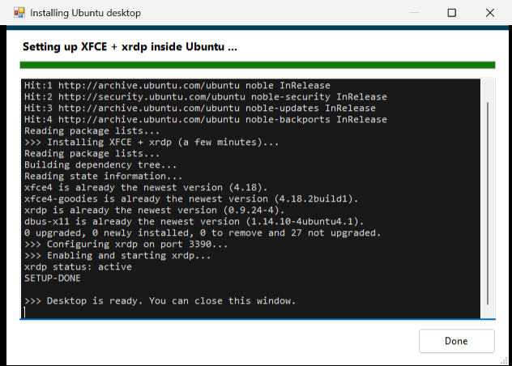

# UbuntuDesktop — WSL2 Ubuntu desktop launcher for Windows

UbuntuDesktop is a portable Windows executable that installs XFCE and xrdp inside a WSL2 Ubuntu
distribution and then opens the full Linux desktop in a fullscreen RDP session, for Windows users
who want a Linux desktop without configuring xrdp by hand.


## Overview

WSL2 runs Linux GUI applications one window at a time through WSLg, but it has no built-in way to
open a complete Linux desktop — panels, dock, file manager — as a single window. The usual
alternative is to install and configure xrdp manually, then type a username and password into the
xrdp login screen on every connection.

UbuntuDesktop does the Linux-side installation from a Windows GUI, starts WSL and xrdp when they
are not running, caches the credential so the xrdp login screen is skipped, and launches `mstsc`
against the WSL distribution.

### What it does

- Installs XFCE and xrdp inside WSL from a single button: sets the port, fixes the `ssl-cert`
  group permission, writes the session file, and enables the service. No terminal commands.
- Opens the desktop with one double-click once setup is done.
- Skips the xrdp login screen by caching the credential and passing it in the generated `.rdp`.
- Opens fullscreen at the monitor's native resolution with smart-sizing on, so resizing scales the
  desktop rather than adding scrollbars. Windowed mode is a checkbox.
- Auto-detects WSL distributions and the Linux username, and shows whether the desktop is
  installed, not installed, or running.
- Starts WSL and xrdp automatically, falling back `systemctl` to `service` to a direct daemon
  launch for distributions without systemd.
- Optionally sets the WSL/Linux password from the app so the Linux and remote passwords stay in
  sync.
- Optionally opens Ubuntu on the virtual desktop to the right of the current one.
- Optionally launches at Windows startup.
- Keeps no secrets in the binary — credentials live in a git-ignored `config.ini`.
- Ships as a single executable built with the C# compiler included in Windows.

## Requirements

- Windows 10 or 11 with WSL2 installed and an Ubuntu distribution
  (`wsl --install -d Ubuntu` in an admin PowerShell, then reboot)

The desktop environment itself is installed by the app.

## Quick start

1. Download `UbuntuDesktop.exe` (see [Releases](../../releases)) and put it in any folder.
2. Run it. On first launch the Settings window opens:
   - Pick your WSL distribution (auto-detected).
   - Your username is filled in automatically; type your Linux password.
   - Click "Install / Repair Ubuntu desktop". A progress window installs XFCE and xrdp and
     configures everything. Wait for "Desktop is ready."
   - Click Save & Connect.
3. The Ubuntu desktop opens fullscreen, already logged in. From then on one double-click is enough.

First launch shows a one-time Windows "Unknown publisher / Connect" prompt for the generated
`.rdp` file. Click Connect. To remove it permanently, see below.

## Usage

### Command-line flags

| Flag | Action |
|---|---|
| *(none)* | Connect to the Ubuntu desktop (opens Settings first if not configured) |
| `/settings` | Open the Settings window |
| `/install` | Open the installer/repair window directly (headless repair) |

### Settings

Open any time with `UbuntuDesktop.exe /settings`.

| Option | What it does |
|---|---|
| WSL distribution | Which distro to launch (dropdown, auto-detected) |
| Username / Password | Your Linux credentials — xrdp signs you in against the real Linux user |
| xrdp port | Default `3390` (avoids clashing with Windows RDP on 3389) |
| Install / Repair Ubuntu desktop | Installs or re-runs the XFCE and xrdp setup inside WSL |
| Also set this as the WSL/Linux password | Pushes the typed password into Linux (`chpasswd`) so both stay in sync |
| Remember password | Caches it for prompt-free auto-login |
| Open in a window instead of fullscreen | Resizable window mode |
| Open on the side virtual desktop | Moves one desktop right (Win+Ctrl+Right) and opens there |
| Launch at Windows startup | Adds the launcher to your Windows startup |

### Username and password are your Linux credentials

xrdp authenticates against the real Linux user, so the remote password is your Linux password.
Change it in Ubuntu (`passwd`) and update it here, or tick "Also set this as the WSL/Linux
password" and the app keeps them in sync.

### Removing the one-time "Connect" prompt (optional)

Windows shows a one-time "Unknown publisher" prompt for any unsigned `.rdp` file. To remove it —
and make startup fully hands-free — run the included script once. It needs your consent because it
adjusts your personal certificate trust:

```powershell
powershell -ExecutionPolicy Bypass -File trust-cert.ps1
```

It creates a self-signed code-signing certificate in your own (current-user) Trusted Publishers
store; the launcher then signs its `.rdp` so `mstsc` connects silently. Undo with
`trust-cert.ps1 -Remove`.

## Screenshots

| Settings and auto-detect | One-click installer |
|---|---|
|  |  |


## How it works

1. Detects WSL and your distributions (`wsl -l -q`, `WSL_UTF8=1`).
2. If the desktop is not installed, runs the XFCE and xrdp setup inside WSL with a live log.
3. If WSL is down, spawns a hidden holder so the VM boots and stays up.
4. Starts xrdp (`systemctl`, then `service`, then a direct daemon launch).
5. Waits for the xrdp port, resolving `localhost` to both IPv4 and IPv6 — the WSL proxy often
   binds `::1` only.
6. Caches the credential with `cmdkey`, writes a temporary `.rdp` (fullscreen, native resolution,
   smart-sizing, clipboard), optionally signs it, and launches `mstsc`.

## Build from source

No SDK required — the .NET Framework compiler ships with every Windows install:

```cmd
build.cmd
```

`make-icon.ps1` regenerates the app icon.

## FAQ

**How do I run a full Ubuntu desktop from Windows?** Install `wsl --install -d Ubuntu`, then run
`UbuntuDesktop.exe` and click "Install / Repair Ubuntu desktop". No terminal needed.

**Do I have to set up xrdp myself?** No — the app installs and configures XFCE and xrdp for you.

**How do I skip the WSL / xrdp login screen?** The launcher caches your credential and passes it
in the `.rdp`, so xrdp logs you in automatically.

**Why was my desktop not fullscreen, or showing scrollbars, before?** The launcher opens at your
monitor's native resolution with smart-sizing on, so it fills the screen and scales like an image.

**Is this different from WSLg?** Yes. WSLg shows individual Linux application windows;
UbuntuDesktop opens the whole desktop as one fullscreen session.

**Does it work on Windows 10?** Yes — Windows 10 and 11 with WSL2.

## Security notes

- The password is stored in plain text in `config.ini` and in Windows Credential Manager
  (`TERMSRV/localhost`). This is intended for a local, single-user machine; xrdp inside WSL2's NAT
  is not reachable from the network.
- `config.ini` is git-ignored; only `config.example.ini` is committed.
- `trust-cert.ps1` only touches your current-user certificate stores and is fully reversible.

## License

[MIT](LICENSE) — free for personal and commercial use.

<sub>Tags: wsl2, wsl, ubuntu, linux-desktop, xrdp, remote-desktop, rdp, xfce, windows, wslg, gui, one-click, auto-login, installer, csharp, portable</sub>
